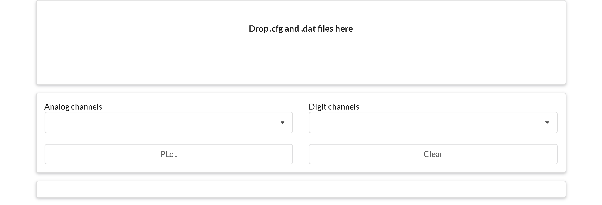
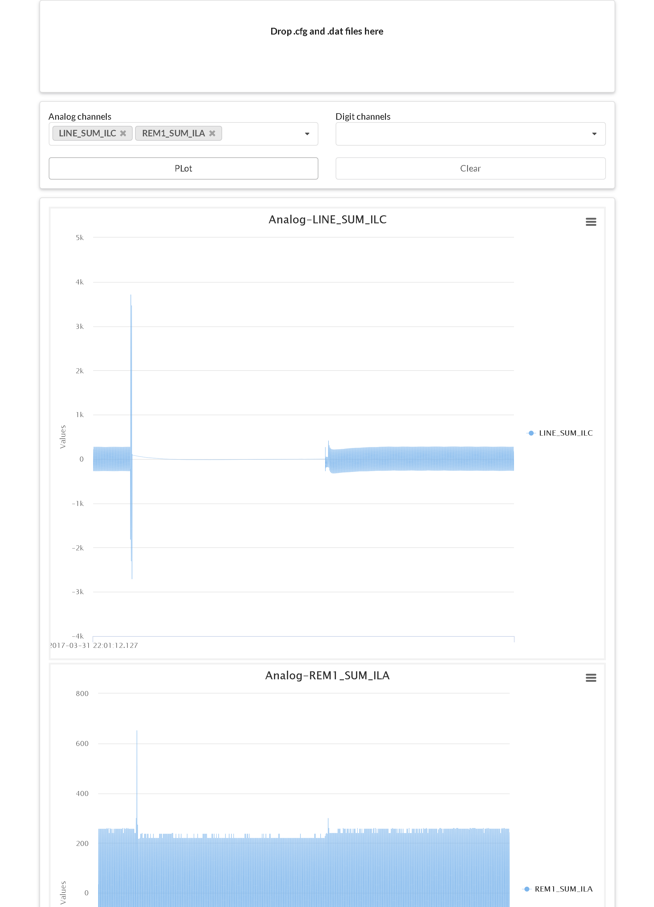

# comgo - web
This is a web chart demo of comgo.

## Tutorials

a. `cd` to current folder
```sh
    $ cd yourpath/wg
```

b. `build` the demo
```sh
    $ go build
```

c. `run` to serve default port (localhost:8000)

```sh
   $ wg
```



d. `drag` .cfg and .dat files to the [drag zone](http://www.dropzonejs.com/) area (@TODO - safari bug)

e. `choose` analogs channels to investigate [charts](https://www.highcharts.com/products/highcharts/) (@TODO - digit channels)



f. `enjoy` the simple demo

g. (notice) `enable` ES6 for .html